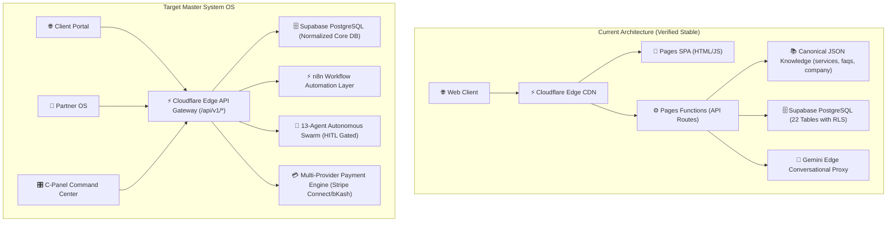

# IINSHA AI OS — Comprehensive Current System Audit & Architecture Report

## 1. Executive Summary
This document provides the foundational deep audit of the **IINSHA AI OS** codebase located at `portfolio-showcase`. It establishes the baseline for transforming the platform into a production-grade **AI Automation Studio + AI/SaaS Marketplace + Affiliate Network + Partner Portal + CRM + Revenue Intelligence + AI Marketing OS + Admin Control Center** without breaking any existing working features.

---

## 2. Comprehensive System Audit Matrix

| Feature / Module | Route / File | Frontend Layer | Backend / API Layer | Database State | Current Status | Dependencies | Risk Level | Action Required |
| :--- | :--- | :--- | :--- | :--- | :--- | :--- | :--- | :--- |
| **Hero & Mission System** | `index.html` | Vanilla HTML5 / CSS, Canvas 3D | Static / Cloudflare Pages | N/A | ✅ Working & Verified | `truth-labels.js`, `style.css` | Low | Preserve intact; wire to dynamic CMS in Phase 4 |
| **Universal AI Copilot 3.0** | `index.html`, `universal_ai_copilot.js` | Neon Glass UI, 7 Modes, Quick Chips | `/api/ai/chat` (Gemini Flash edge worker) | `sessionStorage` Context Memory | ✅ Working & Verified | `functions/api/ai/chat.js` | Medium | Keep edge fallback; connect RAG knowledge base |
| **Service Marketplace** | `marketplace.html`, `store.html` | Dynamic Offer Cards, Modals | `/api/services` | `knowledge/services.json` + `ibos_services` | ✅ Working | `app.js`, `truth-labels.js` | Medium | Maintain canonical catalog; add category filters |
| **28-Pillar Affiliate OS** | `affiliate.html`, `js/core/affiliate-portal.js` | Partner Registration & Live Dashboard | `/api/affiliate/track`, `/go/[slug].js`, `/api/affiliate/convert` | `ibos_affiliates`, `ibos_referral_clicks`, `ibos_conversions` | ✅ Working & Verified | `functions/api/affiliate/*` | High | Preserve 60-day cookie engine; expand fraud checks |
| **Admin C-Panel** | `admin.html` | Tabbed Control Center | `/api/auth/session`, `/api/admin/gate` | `ibos_users`, `ibos_audit_logs` | ✅ Working with Auth Gate | `functions/api/admin/*` | High | Expand multi-role RBAC & Service CMS controls |
| **5-Level Tool Execution** | `functions/api/tools/execute.js` | N/A (Server-side API Gateway) | Edge Worker Sandbox | `ibos_tool_calls`, `ibos_agent_runs` | ✅ Working (86 QA pass) | Cloudflare Pages Functions | High | Maintain strict Level 3 HITL approval pause |
| **Payment & Checkout** | `functions/api/payments/checkout.js` | Checkout Modal in `index.html` | Stripe Connect, bKash, Nagad, Bank | `ibos_orders`, `ibos_revenue` | ✅ Working | Edge Worker | High | Ensure zero client secret leakage |
| **Client Project Portal** | `portal.html` | VPS telemetry & milestone viewer | `/api/projects`, `/api/tickets` | `ibos_projects`, `ibos_support_tickets` | ✅ Working (Simulated badge) | `truth-labels.js` | Medium | Connect to real Supabase project tables |

---

## 3. Current vs. Target Architecture Map



---

## 4. Database Map (Existing Schema vs. Master Specification)

### Existing Tables (22 Tables in `20260818000001_autonomous_company_os.sql`):
1. `ibos_organizations` (Organizations / Clients)
2. `ibos_customer_contacts` (CRM Contacts)
3. `ibos_projects` (Client Projects & Milestones)
4. `ibos_project_tasks` (Project Tasks)
5. `ibos_deliverables` (Work Deliverables & Downloads)
6. `ibos_support_tickets` (Support Tickets & SLA)
7. `ibos_knowledge_documents` (RAG Documents)
8. `ibos_knowledge_chunks` (Vector Embeddings)
9. `ibos_campaigns` (Marketing Campaigns)
10. `ibos_leads` (Scored Inbound Leads)
11. `ibos_lead_events` (Lead Activity Stream)
12. `ibos_referral_clicks` (Affiliate Clicks & Attribution)
13. `ibos_attributions` (Multi-Touch Attributions)
14. `ibos_conversions` (Verified Orders & Conversions)
15. `ibos_commission_ledger` (Affiliate Commissions)
16. `ibos_expenses` (Operational Expenses)
17. `ibos_revenue` (Revenue Tracking)
18. `ibos_subscriptions` (SaaS Subscriptions)
19. `ibos_incidents` (SRE Incidents)
20. `ibos_deployments` (Deployment History & Rollback)
21. `ibos_feature_flags` (Dynamic Flags)
22. `ibos_system_events` (Audit & System Logs)

### Target Additions (Non-Destructive Extension):
- `ibos_affiliate_assets` (Marketing Banners, Email Swipes, Social Copy)
- `ibos_pricing_rules` (Dynamic Currency & Region Rules)
- `ibos_service_addons` (Modular Up-sells)
- `ibos_fraud_events` (Automated Fraud Shield Logs)

---

## 5. Route & Component Map

| URL Route | File Path | Primary Functionality | Target Enhancement |
| :--- | :--- | :--- | :--- |
| `/` | `index.html` | Studio Landing, Hero 3D, Pricing, Copilot | Add live Dynamic Service loader from Supabase |
| `/control-panel` | `admin.html` | C-Panel Command Center, Auth Gate | Multi-tab Service CMS, AI Commander, Audit Logs |
| `/partners` | `affiliate.html` | 28-Pillar Partner OS, Registration, Live Dashboard | Full affiliate asset library & payout queue |
| `/portal` | `portal.html` | Client Portal & System Telemetry | Milestone approvals & file delivery download |
| `/marketplace` | `marketplace.html` | 9 Commercial Categories, Search & Filter | Dynamic Supabase sync & quote builder |
| `/shop` | `store.html` | Turnkey Production Package Checkout | Direct multi-provider payment trigger |
| `/compare` | `compare.html` | IINSHA vs Traditional Agency vs Zapier | Interactive ROI comparison calculator |
| `/blog` | `blog.html` | Architectural Insights & Tech Guides | Programmatic SEO knowledge hub |
| `/go/:slug` | `functions/go/[slug].js` | Server-Side 60-Day Affiliate Redirect | Dynamic cookie & Sub-ID attribution |

---

## 6. Gap Analysis & Conflict Detection

1. **Service CMS Data Sync:**
   - *Current:* Canonical catalog stored in `knowledge/services.json` and client-side memory.
   - *Target:* Full two-way sync with Supabase `ibos_services` so admin edits in C-Panel reflect globally without code deployment.
2. **Affiliate Marketing Asset Center:**
   - *Current:* Static swipe textboxes in `affiliate.html`.
   - *Target:* Database-driven asset library (`ibos_affiliate_assets`) with dynamic referral link injection and 1-click copy.
3. **AI Commander in C-Panel:**
   - *Current:* AI Copilot floating widget on all pages.
   - *Target:* Dedicated Executive AI Commander tab inside `admin.html` for business intelligence queries ("Show today's revenue", "Analyze affiliate conversion").

---

## 7. Phased Implementation Roadmap

```text
PHASE 0: Technical Deep Audit & Baseline Freeze (COMPLETED)
PHASE 1: Database Extensions & RLS Hardening (Additive only)
PHASE 2: Server-Side Tracking & Attribution Engine v2
PHASE 3: 28-Pillar Partner OS & Asset Library Enhancement
PHASE 4: C-Panel Command Center & Service CMS Integration
PHASE 5: Commerce & Multi-Provider Payout Queue (Stripe / bKash)
PHASE 6: Marketplace Dynamic Filter & Client Project Portal
PHASE 7: Full-Funnel Revenue Analytics & Fraud Shield Engine
PHASE 8: 13-Agent Swarm HITL Boundary Enforcement
PHASE 9: Programmatic SEO & Edge Performance Optimization
PHASE 10: Master QA & Regression Testing Suite (Zero Regressions)
```

---

## 8. Rollback & Disaster Recovery Strategy
- All SQL migrations are strictly non-destructive (utilizing `CREATE TABLE IF NOT EXISTS` and additive columns).
- Git version tags and Cloudflare Pages deployment rollbacks ensure instant 1-click recovery in the event of anomalies.
- Zero client-side API secrets guaranteed.
