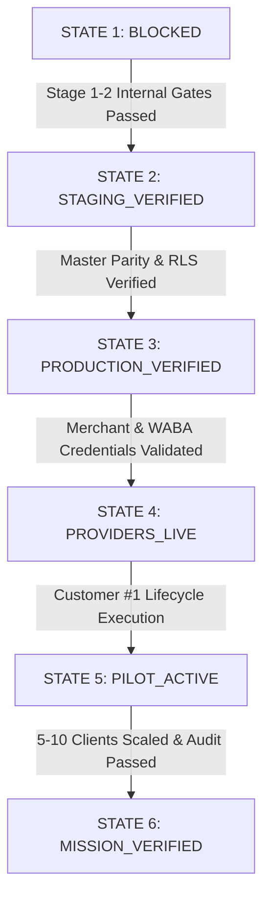

# 👑 IINSHA AI-BOS: FINAL ACTIVATION ORCHESTRATION & PROGRESSION STATE MACHINE

---

## 🏛️ 1. THE NON-SKIPPABLE PROGRESSION STATE MACHINE

Under the Sovereign Governance Constitution, the system transitions linearly through 6 immutable states. **No state can be skipped under any circumstances**:



```text
[BLOCKED] ➔ [STAGING_VERIFIED] ➔ [PRODUCTION_VERIFIED] ➔ [PROVIDERS_LIVE] ➔ [PILOT_ACTIVE] ➔ [MISSION_VERIFIED]
```

---

## 🔄 2. THE COMPLETE 21-STAGE REAL-WORLD EXECUTION SEQUENCE

```text
01. P0 Security & Leak Check = 0 Defects (node scripts/real_world_security_gate.mjs)
02. Staging Preview Certification Gate (PR #6 / PR #7 Branch Isolation)
03. Supabase PostgreSQL 110/110 RLS & Tenant Isolation Test
04. Canonical Production Release & Cryptographic Git SHA Parity
05. Integration Provider Preflight Audit (npm run activation:preflight)
06. Live External Provider Handshake (Stripe, bKash, Meta WABA, Resend)
07. Pilot Customer #1 Real Lead Discovery & Inbound Intake
08. AI Conversational Intent Classification & Discovery
09. Commercial Negotiation Bound by Strict Margin Floors
10. Live Merchant Payment Settlement & Double-Entry Ledger ($850 Split Balance)
11. Deterministic Project Task DAG Formulation & Resource Allocation
12. Autonomous Code Generation & Build in Ephemeral Sandbox
13. Dual-Agent Independent QA Certification (Confidence >= 0.95)
14. Client Portal Staging Preview & Milestone Acceptance Sign-Off
15. Owner Signed L3 Production Release Authorization & Edge Deployment
16. Post-Launch 24/7 AI Health Monitoring & Ticket Support
17. Retainer Invoicing & Automated Subscription Renewal
18. Experience Extraction & Root-Cause Node Formulation
19. Shadow Skill Sandbox Evaluation (>= 0.90) & Owner Promotion
20. Dual-Rail Disaster Recovery & Rollback Drill Verification
21. Scale Cohort (5–10 Enterprise Clients) & 100-Sector Master Sign-Off ➔ [MISSION_VERIFIED]
```

---

## 📊 3. THE 14 PILOT OPERATIONAL KPIS & TARGET THRESHOLDS

Every enterprise pilot is quantitatively audited against 14 owner-defined KPI thresholds:

| KPI ID | Operational Metric | Target Threshold | Audit Method |
| :--- | :--- | :---: | :--- |
| **KPI-01** | Lead ➔ Qualified Conversion | $\ge 25.0\%$ | CRM Funnel Stage Analytics |
| **KPI-02** | Qualified ➔ Proposal Acceptance | $\ge 40.0\%$ | Proposal Engine Acceptance Ledger |
| **KPI-03** | Proposal ➔ Closed Won | $\ge 30.0\%$ | Stripe / bKash Settlement Records |
| **KPI-04** | Sales Cycle Duration | $\le 48\text{ hours}$ | Lead Timestamp to Payment Timestamp |
| **KPI-05** | Project Gross Margin | $\ge 70.0\%$ | Financial Double-Entry Ledger |
| **KPI-06** | AI API Spend per Project | $\le \$5.00\text{ USD}$ | Token Usage Telemetry Ledger |
| **KPI-07** | Delivery Cycle SLA | $\le 72\text{ hours}$ | Task DAG Start to Client Sign-Off |
| **KPI-08** | Escaped Defect Rate | $\le 1.0\%$ | Post-Launch SRE Incident Logs |
| **KPI-09** | Rollback Frequency | $\le 0.5\%$ | Cloudflare Production Deployment Log |
| **KPI-10** | Customer Satisfaction (CSAT) | $\ge 4.8 / 5.0$ | Automated Post-Delivery Client Survey |
| **KPI-11** | Support First Response Time | $\le 60\text{ seconds}$ | Omnichannel AI Whisper Response Log |
| **KPI-12** | Monthly Retainer Renewal Rate | $\ge 85.0\%$ | Subscription Billing Ledger |
| **KPI-13** | Organic Referral Rate | $\ge 20.0\%$ | S2S Affiliate Link Attribution Trace |
| **KPI-14** | Skill Promotion Pass Rate | $\ge 90.0\%$ | Shadow Sandbox Benchmark Oracle |

---

## ⚖️ 4. ABSOLUTE PROHIBITION ON FABRICATED METRICS

Under the Sovereign Policy Constitution, the system is hard-coded to reject certification if any of the following are detected:
- ❌ Fake customers or mock user profiles claiming live status
- ❌ Simulated or fabricated payment transactions
- ❌ Fictitious revenue or financial ledger inflation
- ❌ Ungrounded uptime or SLA claims ("99.8% Success" / "100% Reliable")
- ❌ Fabricated customer testimonials or case studies
- ❌ Unverified regulatory compliance claims
- ❌ Simulated provider health or artificial green status

---

## 🏆 5. THE PERMANENT CYCLE TO MASTER PROOF

$$\text{Build} \longrightarrow \text{Stage} \longrightarrow \text{Verify} \longrightarrow \text{Activate} \longrightarrow \text{Pilot} \longrightarrow \text{Operate} \longrightarrow \text{Measure} \longrightarrow \text{Learn} \longrightarrow \text{Repeat} \longrightarrow \text{Certify}$$
