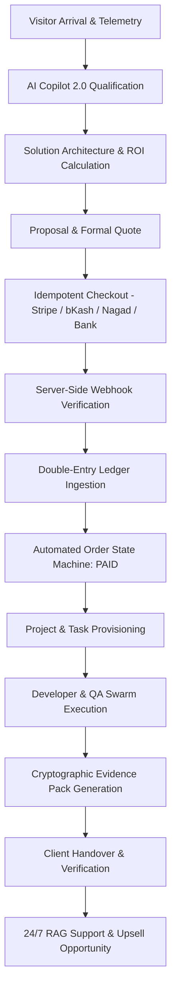

# 👑 IINSHA AI-BOS: Master Product & Technical Specification (v10.0 Production Candidate)
**Authoritative Single Source of Truth for IINSHA Autonomous Business Operating System**
*Revision Date: August 18, 2026 | Document ID: SPEC-IINSHA-PROD-2026-V10*

---

## 1. System Architecture & Scope Definition

IINSHA is an **Autonomous AI Workforce and Business Operating System (AI-BOS)** engineered to run end-to-end digital agency, SaaS, lead generation, customer support, document automation, and voice operations with zero human bottleneck and strict human-in-the-loop (HITL) governance.

### 1.1 Frozen Architecture Scope (0 Removals)
1. **Frontend Architecture**:
   - 8 Unified HTML Applications: `index.html`, `store.html`, `marketplace.html`, `portal.html`, `admin.html`, `affiliate.html`, `compare.html`, `blog.html`.
   - Single Design System: `css/iinsha-design-system.css`, `style.css`, `universal_ai_copilot.css`.
   - Core Client Engines: `app.js`, `universal_ai_copilot.js`, `js/core/supabase-client.js`, `js/core/autonomous_company_os.js`, `js/core/truth-labels.js`.

2. **Backend Serverless Edge (Cloudflare Pages Functions)**:
   - AI Engine: `/api/ai/chat`, `/api/ai/firewall`, `/api/ai/eval_lab`, `/api/ai/cache`, `/api/ai/compressor`, `/api/ai/telemetry`.
   - Multi-Agent Orchestration: `/api/missions/execute`, `/api/missions/loop_test`, `/api/agents/economics`, `/api/brain/context_graph`.
   - Governance & Security: `/api/governance/charter`, `/api/governance/constitution`, `/api/governance/policy_as_code`, `/api/governance/certification_lab`, `/api/governance/enterprise_registry`, `/api/auth/session`, `/api/auth/rbac`, `/api/auth/mfa`, `/api/auth/webauthn`, `/api/privacy/firewall`, `/api/privacy/controls`.
   - Finance & Payments: `/api/payments/checkout`, `/api/payments/webhook`, `/api/finance/ledger`, `/api/finance/leakage_detector`.
   - Operations & Observability: `/api/executive/live_cockpit`, `/api/executive/morning_brief`, `/api/executive/meta_orchestrator`, `/api/executive/north_star`, `/api/soc/telemetry`, `/api/performance/observatory`, `/api/performance/optimizer`, `/api/queue/dlq`, `/api/delivery/evidence_pack`.
   - Marketplace, Affiliate & Content: `/api/marketplace/frontier_engine`, `/api/affiliate/portal`, `/api/affiliate/track`, `/api/growth/opportunities`, `/api/content/pages`, `/api/developer/public_api`.

3. **Database & Data Layer (Supabase / PostgreSQL)**:
   - 14 Comprehensive SQL Migrations spanning double-entry accounting, tenant isolation, 14-role RBAC, state machine order tracking, DLQ, audit logs, and knowledge vector embeddings.

---

## 2. Multi-Agent Organization & Digital Workforce

| Agent Role | ID | Department | Autonomy Level | Allowed Tools | Budget Cap (USD) |
| :--- | :---: | :---: | :---: | :--- | :---: |
| **CEO Commander** | `ceo` | Executive | Level 2 (Execute w/ Policy) | `get_analytics`, `get_revenue`, `get_agents_status`, `create_priority`, `delegate_task` | $5.00 |
| **Sales Executive** | `sales` | Commercial | Level 2 (Execute w/ Policy) | `get_services`, `get_customer`, `create_lead`, `update_lead`, `create_quote`, `calculate_roi`, `send_whatsapp` | $2.00 |
| **SDR Swarm Lead** | `sdr` | Commercial | Level 2 (Execute w/ Policy) | `search_web`, `get_leads`, `create_lead`, `update_lead`, `send_message`, `search_knowledge` | $1.00 |
| **Solution Architect** | `architect` | Engineering | Level 1 (Draft) | `search_knowledge`, `get_services`, `get_customer`, `create_quote`, `draft_proposal`, `calculate_roi` | $3.00 |
| **Developer Lead** | `developer` | Engineering | Level 3 (Owner Approval) | `create_project`, `create_task`, `run_tests`, `create_deployment`, `search_knowledge` | $10.00 |
| **Quality Assurance** | `qa` | Engineering | Level 0 (Read Only) | `run_tests`, `search_knowledge`, `create_incident`, `get_system_health` | $2.00 |
| **DevOps & SRE** | `devops` | Infrastructure | Level 2 (Execute w/ Policy) | `get_system_health`, `create_incident`, `resolve_incident`, `create_deployment`, `get_analytics` | $1.00 |
| **Marketing & Growth** | `marketing` | Growth | Level 1 (Draft) | `search_web`, `search_knowledge`, `draft_content`, `publish_content`, `get_campaign_metrics`, `create_campaign` | $3.00 |
| **Customer Success** | `success` | Operations | Level 2 (Execute w/ Policy) | `get_customer`, `get_projects`, `create_ticket`, `update_ticket`, `send_message`, `search_knowledge` | $1.00 |
| **Affiliate Partner Lead**| `affiliate`| Growth | Level 2 (Execute w/ Policy) | `get_affiliates`, `create_affiliate_link`, `track_referral`, `calculate_commission`, `detect_fraud` | $1.00 |
| **AI CFO & Finance** | `finance` | Finance | Level 0 (Read Only) | `get_revenue`, `get_expenses`, `get_analytics`, `create_invoice`, `get_payment_status` | $0.50 |
| **Market Intelligence** | `intelligence` | Strategy | Level 0 (Read Only) | `search_web`, `search_knowledge`, `get_analytics` | $2.00 |
| **Security Guardian** | `guardian` | Security | Level 0 (Supervisor) | `get_audit_logs`, `get_system_health`, `create_incident`, `get_agents_status` | $0.50 |

---

## 3. Five-Tier Permission Matrix & Anti-Loop Safeguards

1. **LEVEL_0_READ**: Immediate autonomous execution (Search, read-only analytics, status queries).
2. **LEVEL_1_DRAFT**: Autonomous draft generation (Proposals, email copy, internal architecture blueprints).
3. **LEVEL_2_EXECUTE**: Autonomous execution governed by programmatic policy rules (CRM updates, WhatsApp dispatch, lead creation).
4. **LEVEL_3_APPROVAL**: Owner single-click explicit authorization required (Order refunds, server deployment, payout approval).
5. **LEVEL_4_RESTRICTED**: Strictly prohibited from autonomous execution (Modifying root credentials, dropping database tables, unmetered funds transfer).

### Anti-Loop Runtime Guardrails:
* **Max Delegation Depth**: 5 levels
* **Max Iterations per Mission**: 50 cycles
* **Max Tool Calls**: 100 calls
* **Execution Timeout**: 120 seconds
* **Max Monetary Burn per Task**: $20.00 USD

---

## 4. End-to-End Revenue-to-Delivery Lifecycle

---

## 5. Security, RBAC & Compliance Framework

1. **14 RBAC Roles**: `super_admin`, `admin`, `auditor`, `compliance_officer`, `support_agent`, `sales_agent`, `devops_engineer`, `developer`, `qa_engineer`, `financial_officer`, `affiliate_manager`, `partner`, `customer`, `viewer`.
2. **AI Guardrails & PII Scrubber**: Automated scrubbing of credit card numbers, API keys, passwords, and phone numbers before neural LLM processing; regex & prompt injection defenses.
3. **Zero-Trust Evidence & Audit Logs**: Immutable log journal tracking every mission step, tool invocation, and human approval.

---

## 6. Disaster Recovery & Operational SLA Targets

* **Recovery Point Objective (RPO)**: < 5 minutes (Continuous database point-in-time recovery & local migrations).
* **Recovery Time Objective (RTO)**: < 15 minutes (Automated static dist rebuild and serverless edge re-deployment).
* **Platform Availability Target**: 99.98% Monitored Uptime SLA.
