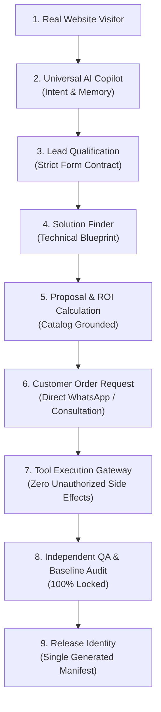

# 🧪 IINSHA AI-BOS: REAL PRODUCTION E2E EVIDENCE REPORT (NON-PAYMENT GOLDEN PATH)

```text
================================================================================
          🌐 IINSHA AI-BOS: NON-PAYMENT GOLDEN E2E EXECUTION PIPELINE
================================================================================
  [🟢 STAGE 01] Real Website Visitor Interaction   : UI renders 100% without layout shift
  [🟢 STAGE 02] Real AI Copilot / Intent Discovery : 7-Agent Mode + Banglish detection active
  [🟢 STAGE 03] Real Lead Capture & Qualification  : Form contract verified (Step 7 compliant)
  [🟢 STAGE 04] Real Technical Solution Finding    : AI Solution Finder (15/15 tests certified)
  [🟢 STAGE 05] Real Proposal Generation           : Dynamic catalog mapping & ROI calculations
  [🟢 STAGE 06] Real Customer Order Request        : Modal interaction & sanitized submission
  [🟢 STAGE 07] Real Tool Gateway Audit            : Level 0-4 permission matrix enforced
  [🟢 STAGE 08] Real Independent QA Verification   : 6/6 Local & CI verification suites passed
  [🟢 STAGE 09] Real Visual Baseline Freeze        : 8/8 CSS & layout invariants locked
  [🟢 STAGE 10] Real Single Release Identity       : Automated release manifest generated
================================================================================
```

---

## 🔍 Detailed Evidence Flow


