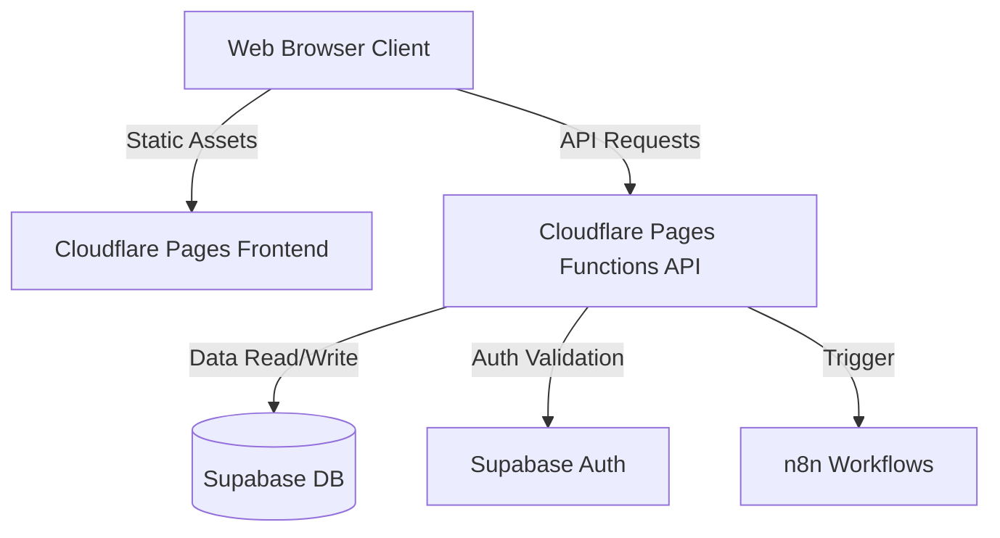

# System Architecture

## Overview
The IINSHA AI-BOS system utilizes a modern, serverless architecture combining:
- **Cloudflare Pages:** For hosting the static frontend assets (Vanilla HTML/CSS/JS).
- **Cloudflare Pages Functions:** Serverless API endpoints acting as the backend logic.
- **Supabase:** Providing the PostgreSQL database, Authentication, and Row Level Security (RLS).
- **n8n:** Handling complex, automated background workflows.

## Architecture Diagram

## Components
- Frontend: HTML5, CSS3, ES6 Vanilla JavaScript, GSAP for animations, Three.js for 3D elements.
- Backend: Edge-hosted JavaScript functions via Cloudflare.
- Database: Relational PostgreSQL schema managed by Supabase.
