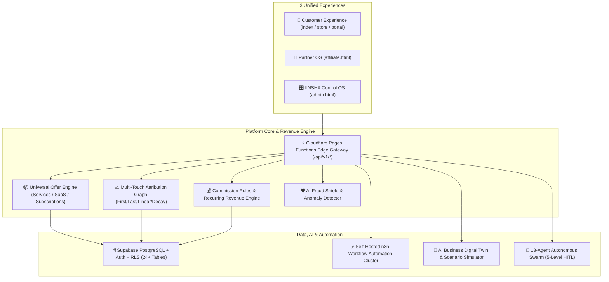

# IINSHA AI OS — Ultimate Master Roadmap Audit & Architecture Plan

## 1. Executive Summary & Vision Statement
The **IINSHA AI OS** (`https://inshatech.pages.dev/`) is structured to operate not as a mere agency website, but as a unified **AI Automation Studio + SaaS Marketplace + 28-Pillar Partner OS + CRM + Revenue Intelligence + AI Digital Twin + IINSHA Control OS**.

---

## 2. Existing Feature Inventory (Zero-Regression Guarantee)

| Layer / Module | Route / File Path | Current Status | Existing Assets Preserved | Non-Negotiable Rule |
| :--- | :--- | :--- | :--- | :--- |
| **Studio Landing & Hero 3D** | `index.html` | ✅ Fully Operational | Canvas 3D, Particles, 5 Pillars, Truth Labels | Must preserve visual aesthetic & responsiveness |
| **Universal AI Copilot 3.0** | `universal_ai_copilot.js` | ✅ Fully Operational | 7 Agent Modes, Context Memory, Interactive Quick Chips | Must keep offline fallback & zero-repetition logic |
| **Marketplace & Store** | `marketplace.html`, `store.html` | ✅ Fully Operational | 9 Categories, 80+ Micro-services, Checkout Modal | Must keep canonical pricing & exchange rate ($1=৳122.50) |
| **Partner OS** | `affiliate.html`, `affiliate-portal.js` | ✅ Fully Operational | 60-day cookie tracking, 4-metric grid, 1-click assets | Must keep instant registration & withdrawal requests |
| **Client Portal** | `portal.html` | ✅ Fully Operational | VPS telemetry, project milestone viewer | Must connect to real Supabase project tables |
| **Admin Control OS** | `admin.html` | ✅ Fully Operational | Auth gate, tabbed command center, SRE logs | Expand into full IINSHA Control OS with 12 sub-engines |
| **Edge Functions Gateway** | `functions/api/*` (9 routes) | ✅ Fully Operational | 5-level sandbox, checkout, webhooks, tracking | Zero client-side API secret exposure |
| **Database Core** | Supabase Migrations 1 & 2 | ✅ Fully Operational | 24+ unified tables with RLS and foreign keys | Non-destructive additive migration only |

---

## 3. Master Target Architecture Map



---

## 4. Universal Offer Engine Architecture
To avoid fragmenting Services, SaaS, Subscriptions, and Affiliate Offers, every commercial unit is modeled as a **Universal Offer**:

```json
{
  "offer_id": "b2b-lead-swarm",
  "title": "B2B SaaS 5-Agent Hunter Swarm",
  "type": "turnkey_service",
  "category": "AI Automation",
  "pricing": {
    "model": "fixed_with_recurring_maintenance",
    "base_usd": 850.00,
    "base_bdt": 104125.00,
    "maintenance_usd_per_mo": 150.00,
    "currency": "USD"
  },
  "affiliate": {
    "eligible": true,
    "upfront_commission_percent": 20.0,
    "recurring_commission_percent": 15.0,
    "cookie_duration_days": 60,
    "min_tier": "Bronze"
  },
  "deliverables": [
    "5 Stealth Scraping Agents",
    "Corporate MX Verification",
    "CRM & Google Sheets Auto-Sync"
  ],
  "marketing_assets": [
    "asset-linkedin-01",
    "asset-email-01",
    "asset-badge-01"
  ]
}
```

---

## 5. 20-Phase Master Implementation Roadmap

1. **Phase 1: Deep Audit & Feature Inventory** *(Completed)*
2. **Phase 2: Database Schema Normalization & Additive Migrations**
3. **Phase 3: Universal Offer Engine Implementation**
4. **Phase 4: Server-Side 60-Day Attribution Graph v2**
5. **Phase 5: Multi-Touch Attribution Engine (First, Last, Linear, Position-based)**
6. **Phase 6: Partner OS Mobile-First Experience & Asset Center**
7. **Phase 7: Partner Marketplace 2.0 with EPC & Potential Earning Filters**
8. **Phase 8: Visual Commission Rules Engine**
9. **Phase 9: Ledger-Based Accounting & Multi-Provider Payouts (Stripe / bKash)**
10. **Phase 10: IINSHA Control OS Full Sidebar Navigation & CMS**
11. **Phase 11: CRM Integration (Leads, Contacts, Deals, Pipelines)**
12. **Phase 12: AI Affiliate Copilot ("Grow My Affiliate Business")**
13. **Phase 13: AI Sales & Marketing OS (Inbound Qualification & Content Swipes)**
14. **Phase 14: AI Fraud Intelligence & Risk Scoring (0-100)**
15. **Phase 15: n8n Workflow Automation Cluster & Event Triggers**
16. **Phase 16: Revenue Intelligence & Service Profitability (MRR, LTV, CAC, Margins)**
17. **Phase 17: Reseller & Agency Partner White-Label Portal**
18. **Phase 18: Multi-Currency & Internationalization Layer**
19. **Phase 19: Security, RBAC, 4-Level HITL Sandbox & Load Testing**
20. **Phase 20: Production Rollout, Telemetry & Disaster Recovery**

---

## 6. 4-Level Human-in-the-Loop (HITL) Security Matrix

| Permission Level | Permitted Operations | Execution Type | Safety Guarantee |
| :--- | :--- | :--- | :--- |
| **LEVEL 0 — OBSERVE** | Read analytics, search RAG knowledge, telemetry | Autonomous | Zero side-effects |
| **LEVEL 1 — DRAFT** | Draft emails, proposals, SEO articles, campaign copy | Autonomous | Requires human review before publishing |
| **LEVEL 2 — APPROVE** | Update CRM leads, create tracking links, schedule posts | Policy-checked | Automatically validated against business rules |
| **LEVEL 3 — RESTRICTED** | Money movement, payouts, order creation, refunds, schema drops | **Strict HITL Pause** | Requires explicit Owner authentication & confirmation |
